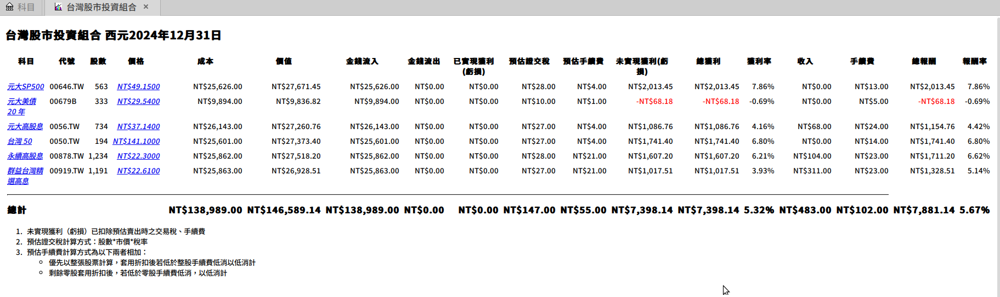
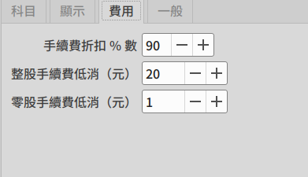

GnuCash 台灣股市投資組合報表
============================

原本 GnuCash 內建的「進階投資組合」報表中的末實現獲利（虧損）一欄，不會包含賣出股票時的手續費與證交稅。這個版本的報表，會將賣出時的手續費與證交稅算入，方便使用者更精確地掌握到實際可能產生的損益。

使用者可以在報表選項的「費用」頁籤中，設定自己券商的手續費折扣，以及買賣股票時的低消。

這個報表使用以下方式計算賣出時的預估證交稅與手續費：

證交稅
-------

1. 一般股票證交稅 = 市值 * 0.003
2. ETF 股票證交稅 = 市值 * 0.001

此報表會依照股票科目的「代號」來判斷是否為 ETF，若為 00 開頭則視為 ETF。

手續費
--------

此報表會以賣出整張股票的手續費再加上零股手續費來計算。舉例而言，若報表內有下列資訊的股票：

1. 股數：2345
2. 價格：25

則會加總下列的手續費

1. 2000 * 25 * 0.01425 * 折扣，若末滿整股交易低消以低消計
2. 345 * 25 * 0.01425 * 折扣，若末滿零股交易低消以低消計

Screenshot
-----------



使用方式
-----------

1. 下載 tw-stock.scm 此檔案至 [GNC\_DATA\_HOME][01]
2. 編輯 [GNC\_CONFIG\_HOME][02]`/config-user.scm` 此檔案，並加入以下內容
   ```
   (load (gnc-build-userdata-path "tw-stock.scm"))
   ```
3. 關閉並重新開啟 GnuCash
4. 點選「報表」->「資產 & 負債」->「台灣股市投資組合」

[01]: https://wiki.gnucash.org/wiki/Configuration_Locations#GNC_DATA_HOME
[02]: https://wiki.gnucash.org/wiki/Configuration_Locations#GNC_CONFIG_HOME
